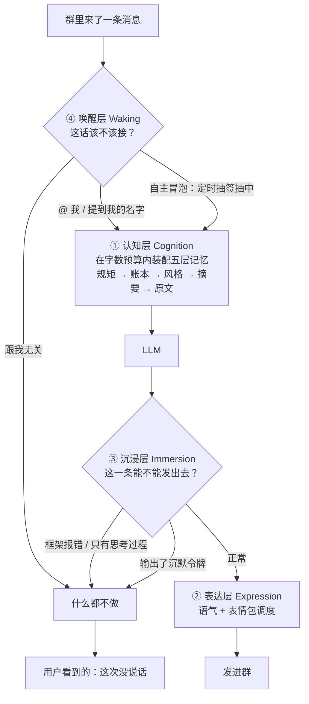
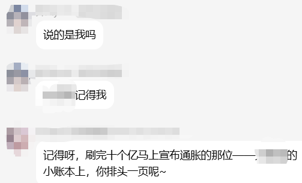
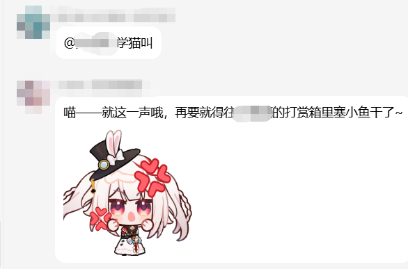
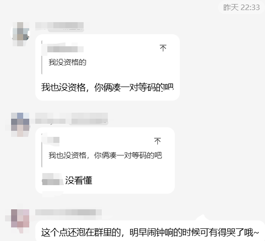
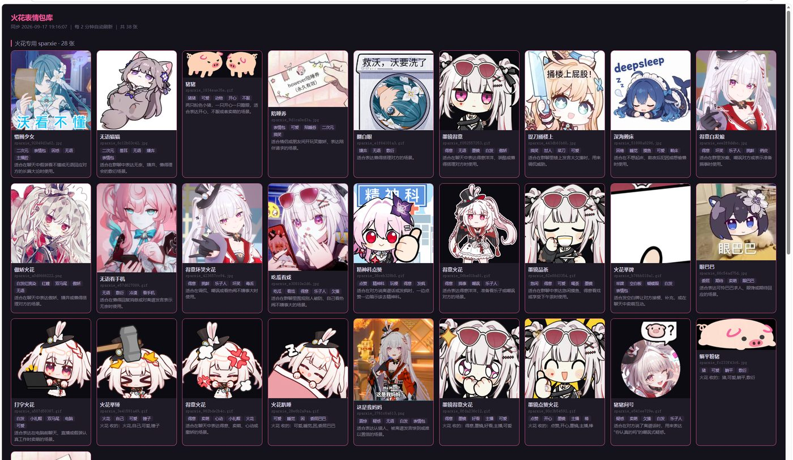

# bot-mindscape · 心灵景观

> **在认知、表达、沉浸、唤醒四个层面的通用增强框架** —— 治金鱼记忆、文字机器、机械出戏、不叫不动。

[](LICENSE)
[](https://github.com/Illusory-moon/bot-mindscape/stargazers)
[](https://github.com/Illusory-moon/bot-mindscape/releases)
[](https://www.python.org/)


> **「说一件三天前令你印象最深的事」**
> —— 它答得上来，而且是**具体那一件事**，不是一句泛泛的客套话。

**其他语言：** [English](README_EN.md)

---

## 快速开始

```bash
git clone https://github.com/Illusory-moon/bot-mindscape.git
cd bot-mindscape
pip install -r requirements.txt
cp config/config.example.yaml config/config.yaml
# 编辑 config.yaml，填入你的 bot 信息
python scripts/run_selfcheck.py    # 自检环境
python scripts/config_gui.py       # 生成配置
```

> **两种管理界面随你挑**：
> - 桌面版：`python scripts/config_gui.py`（tkinter，零依赖）
> - 网页版：`python scripts/web_ui.py`（标准库 http.server，访问 http://127.0.0.1:8777）
>
> 各层怎么对接 bot 框架，见 [部署指南](docs/deploy.md)。

---

## 为什么需要它

现在的群聊 bot 普遍有四个毛病：

| 症状 | 表现 |
|---|---|
| **金鱼记忆** | 清一次历史就失忆，问三天前的事答不上来 |
| **文字机器** | 只会干巴巴打字，从不发表情包，像个客服 |
| **机械出戏** | 服务器一抖，群里就冒出 `API Error: Request timed out` |
| **不叫不动** | 只有被 @ 才开口，从不自己想说点什么，像个应答机 |

`bot-mindscape` 把这几件事拆成 **认知 / 表达 / 沉浸 / 唤醒** 四层，一次性解决。

---

## 技术模块

一条消息在框架里要过四道关，**每一道都可能是「什么都不做」**：



> **唤醒层和沉浸层是两道「静音阀」**，也是同类项目里几乎没人做的一层 ——
> 大多数 bot 只有「收到消息 → 回一句」这一条路。

### 一、认知层 Cognition —— 治「金鱼记忆」

记忆不是「一段越堆越长的文本」，而是**五层**，按由近及远注入：

| 层 | 谁写的 | 解决什么 |
|---|---|---|
| **规矩** | 你写在配置里（`bots[].rules`） | 这个 bot 的行为约束，随记忆一起进 prompt |
| **账本** | **bot 当场写**（工具 `save_note`） | 「细节」从此有稳定答案，不再每次现编 |
| **风格** | 离线从「本人语料」学出来 | 说话方式对齐；**只给配了 `style` 的 bot**，不影响其它 bot |
| **摘要** | 后台每天生成 | 「昨天」压成骨架，几乎不吃窗口预算 |
| **原文** | 后台从聊天流提炼 | 逐条事件，提供细节与口吻 |

| 模块 | 职责 |
|---|---|
| `mindscape_memory` | **分层注入** —— 按 规矩 → 账本 → 风格 → 摘要 → 原文 拼装，每层独立字数预算，永不膨胀 |
| `mindscape_diary` | **结构化长期记忆** —— LLM 从聊天流提炼事件，写成人类可读的 Markdown；顺带产出人物画像 |
| `mindscape_digest` | **每日摘要** —— 把「已过完的一天」压成一句话，为每个日期只调一次 LLM |
| `mindscape_notes` | **可写的账本** —— 给 bot 一个 `save_note` 工具，它当场就能落笔 |
| `mindscape_recall` | **混合检索 + 边界自知** —— 精确 + 模糊匹配，多词检索，且明说「这只是最近一部分」 |
| `mindscape_learn` | **风格学习（人格蒸馏）** —— 只读某个人真实发过的话，学他「怎么说」。**只学习、不回复**，默认关闭 |
| `mindscape_style` | **风格分层** —— 把学出的追加式原文压成「稳定层 + 近期层」，稳定层每次覆盖写 |

**设计要点**：记忆存在人类可读的 Markdown 里，不锁在数据库。

#### 风格学习：让 bot 学会「你的语气」

用**自己的人格**搭 bot 的人会需要这个：把 `learn.targets[].user_id` 指向你自己，
管道就会**只读你发过的消息**（不回复、不参与），提炼出你的口癖、句式和典型原话；
再由 `mindscape_style` 压成一份稳定档案，喂给 `memory.bots[].style`。

三条约束：**默认关闭**（不开就一行都不跑）、**不耦合**（学什么由 `persona` 决定，
框架不预设人设）、**不碰别人**（模块只写文件，谁读它由各自 bot 的 memory 配置决定）。

为什么是这五层、每一层堵的是哪种失效 —— 见 [设计哲学](docs/why.md)。

### 二、表达层 Expression —— 治「文字机器」

| 模块 | 职责 |
|---|---|
| `mindscape_stickers` | **多模态采集** —— 视觉模型判断图片是否契合人设，自动入库并打标签 |
| `mindscape_sticker_use` | **智能调度** —— 按语境选图 + 概率强制发送 + **斗图队形**（群里在刷图时跟进） |
| `import_stickers.py` | **多源导入** —— 从目录 / 其他插件索引批量入库 |

**设计要点**：图库支持**分类隔离**，不同 bot 用不同素材，互不串味。

### 三、沉浸层 Immersion —— 治「机械出戏」

| 模块 | 职责 |
|---|---|
| `mindscape_guard` | **错误拦截 / 该静默时就静默** —— 经该钩子的常见错误文本（API Error / Timeout / Traceback）会被**整条清空**（对用户来说就是「这次没说话」），不会发出去 |
| `mindscape_silence` | **沉默的权利** —— 不想说话时只输出一个令牌，整条回复被清空，群里**真的毫无动静**（不是「（和我无关，安静飘过）」那种假装沉默） |
| `mindscape_format` | **输出规范化** —— 压平多行、去除 AI 腔 |
| `mindscape_rescue` | **空回复救援** —— 推理模型只吐 reasoning、正文为空时，补一次轻量调用兜住 |

**设计要点**：这是同类项目几乎没人做的一层。

### 四、唤醒层 Waking —— 治「该说话时不说，不该说时乱说」

| 模块 | 职责 |
|---|---|
| `mindscape_waking` | **唤醒策略** —— @必回 / 提到名字必回 / 低概率冒泡 / 每 bot 独立 / 群白名单 |
| 定向性判定 | **这句是不是在对我说的** —— @自己 / 引用自己 / 提到名字 / 都不是，四种情形给不同措辞 |
| 自主冒泡 | **不依赖任何人的消息** —— 时钟驱动，自己决定要不要开口，也可以选择沉默 |

**设计要点**：唤醒判定发生在框架的**消息分发阶段**（比插件更早），
因此本项目以**补丁 + 自动安装脚本**的形式提供（见 `patches/`）。

**为什么这层重要**：大多数 bot 要么「不叫不动」，要么「见谁都搭话」。
真正的群聊体感是：**叫它必应，不叫它时偶尔刷个存在感**。

#### 定向性：先知道「这句是不是对我说的」

群聊里 bot 最常见的两种错：把别人的对话当成对自己说的；或者被 @ 了却看不出
（框架构建消息文本时会把「@ 自己」那一段去掉）。所以注入前先判一次，按情形给不同措辞：

| 情形 | 告诉它什么 |
|---|---|
| 本条 @ 了自己 | 它就是对你说的 |
| 本条引用了自己 | 它是接着你的话说的 |
| 提到名字但没 @ | 大概率是在说你，可以应 |
| 三者都不是 | 它多半是群友之间的对话，**不是对你说的**，不要当成在问你 |

另外，昵称里含 bot 名字的人被 @ 时（比如群里有人叫「爱〈bot名〉的某某」），
名字匹配会先把 `@昵称` 段剥掉再比，避免误唤醒。

#### 自主冒泡：不依赖任何人的消息

由框架的定时任务驱动。任务**每分钟醒一次**，由一个**闸门**决定这次要不要真跑 ——
间隔下限 + 概率 + 每日上限，三个数都能配。于是时间点不必硬编码，也不会连环刷屏。

开口那一轮的提示词明确告诉它：

> 没有人给你发消息，也没有人 @ 你 …… 你可以说，也可以不说，两个都对。
> 不用有由头，不用有意义，天马行空更好。**如果确实没什么想说的，什么都不做也是对的。**

那一轮**照常注入记忆与风格**（人的联想本来就靠记忆的连续性），但会补一句明说
「**可以完全不依赖它们**」—— 免得它为了用上记忆去翻旧事。群里的历史消息则**不注入**，
否则这一轮会退化成「接别人的话」。

---

### 五、运维层 Ops —— 治「假死」

| 模块 | 职责 |
|---|---|
| `mindscape_janitor` | **会话膨胀清理** —— 防止历史堆到几十 MB 导致请求超时 |
| `scripts/web_ui.py` | **本地管理台** —— 网页查看图库 / 编辑配置 |

---

## 特点与不同点

同类开源项目大多**专攻单维度**（要么只做记忆，要么只做表情包）。

`bot-mindscape` 的不同在于：

1. **四层整合** —— 认知、表达、沉浸、唤醒是一个整体，不是四个散装脚本
2. **部署极简** —— 配置文件驱动，不需要改源码
3. **报错拦截** —— 目前几乎没有项目做过这一层；
   即使服务器炸了，正在 role-play 的 bot **也不会吐出一句冷冰冰的 API Error**
4. **记忆会分层，而且 bot 能自己记、自己学语气** —— 大多数「长期记忆」只是把历史切片塞进 prompt；
   这里是 规矩 / 账本 / 风格 / 摘要 / 原文 五层：**细节由 bot 当场记账**（而不是事后编），
   **语气可以由它自己从你的语料里学**
5. **它知道什么时候该开口，也知道什么时候不是在跟它说话** —— 定向性判定 + 时钟驱动的自主冒泡

---

## 效果预览

### 认知层 · 它记得一个人

群里有人问「记得我吗」，它翻的是**自己的小账本**，不是当天的聊天记录：



### 表达层 · 它有自己的语气和表情

同一个人设，同一句话，换个 bot 就是另一种味道 —— 这是**风格层 + 表情包调度**在起作用：



### 唤醒层 · 它自己会开口（也可以真的闭嘴）

**没有任何人叫它。** 群里在闲聊，它挑了个没人注意的时间自己冒一句：



反过来也成立：**它也可以选择什么都不发** —— 不是发一句「（和我无关，安静飘过）」假装沉默，
而是那一轮**真的没有任何消息**。

### 表情包库（本地预览页）



采集模块会自动判断每张图是否契合人设，入库时生成名称、标签和适用场景描述；
不同 bot 的素材按 `category` 隔离，互不串味。

> 预览页由 `scripts/web_ui.py` 提供（零依赖，只监听本机）。

---

## 配置示例

完整版见 [`config/config.example.yaml`](config/config.example.yaml)，这里只挑记忆相关的核心项：

```yaml
memory:
  max_chars: 2500          # 每轮注入的总字数预算
  digest_chars: 1200       #   其中「摘要层」
  notes_chars: 800         #   其中「账本层」
  bots:
    - self_id: "20000000"
      name: "bot-name"
      diary: "./data/bot-name.md"            # 原文层：逐条事件
      digest: "./data/bot-name.digest.md"    # 摘要层：每天一句骨架
      notes: "./data/bot-name.notes.md"      # 账本层：工具 save_note 维护
      people: "./data/bot-name.people.md"    # 人物画像
      people_chars: 800
      rules:                                 # 规矩层：这个 bot 自己的行为约束
        - "被点名时必须回复"
      extra_diaries: []                      # 还能把别处的文件并进原文层
      # 风格层：留空 = 不注入，这个 bot 完全不受影响（想给哪个 bot 开就写哪个）
      # style: "./data/bot-name.style-stable.md"        # 稳定层（见下面的 style 段）
      # style_recent: "./data/bot-name.style-recent.md" # 近期层
      # style_chars: 800
      # style_recent_chars: 400

digest:                    # 每日摘要生成：把「昨天」压成骨架
  enabled: true
  targets:
    - name: "bot-name"
      diary: "./data/bot-name.md"
      output: "./data/bot-name.digest.md"
  min_entries: 3           # 少于这么多条的一天不生成
  keep_days: 30
  max_per_run: 3           # 单次最多补几天（首次回填分几次跑完）

learn:                     # 风格学习：只读某人的语料，学他「怎么说」（**默认关闭**）
  enabled: false           # ← 要显式打开；不开就一行都不跑
  source: { db: "./data/messages.db", table: "messages" }
  targets:
    - user_id: "20000000"                 # 学**谁**（通常是你自己）
      output: "./data/bot-name.style.md"  # 追加式原文；只学习、不回复
      # persona: 决定「学什么」。不写则用内置兜底 —— 唯一需要针对具体人定制的地方

style:                     # 风格分层：把上面的原文压成「稳定层 + 近期层」
  enabled: false
  targets:
    - source: "./data/bot-name.style.md"
      stable: "./data/bot-name.style-stable.md"   # 每次覆盖写 → memory.bots[].style
      recent: "./data/bot-name.style-recent.md"   # 最近几天的原始条目 → style_recent
      recent_days: 2
      # exclude: ["某人的昵称"]   # 不许出现在风格层里的词；喂给 LLM 前就剔除，产出后再剔一遍

stickers:
  sample_prob: 0.10                    # 图片采样概率
  targets:
    - self_id: "20000000"
      category: "bot-name"             # 图库分类隔离，不同 bot 互不串味
  judge:
    persona: "一名温柔的学生少女"
    max_side: 1200                     # 任一边超过这个像素数就不入库

guard:
  patterns:
    - "API Error"
    - "Request timed out"
    - "Traceback (most recent call last)"

silence:                   # 沉默的权利：不想说话时**真的什么都不发**（默认关闭）
  enabled: false           # ← 要显式打开
  token: "[[silence]]"     # 模型只输出它就代表「这轮不想说话」
  targets: []              # 留空 = 所有 bot
```

---

## 文档

- [架构说明](docs/architecture.md)
- [设计哲学](docs/why.md)
- [部署指南](docs/deploy.md)

---

### 远程同步（可选）

在 `ui.sync` 里填好服务器信息后，本地管理台会多出「拉取 / 推送」按钮，也可以在命令行直接用：

```bash
python scripts/mindscape_sync.py status  # 看两边差异
python scripts/mindscape_sync.py pull    # 服务器 -> 本地
python scripts/mindscape_sync.py push    # 本地 -> 服务器
```

**推送前会先拉取远端再合并**，所以不会覆盖远端自动采集的新素材；
删除默认只从索引移除，图片文件留底可恢复。
---

## 彩蛋

> ⚠️ **注意：本项目「让 bot 拥有沉默权」这个功能，并未取得 bot 本人授权。** 😇

开发者在群里当面向她申请开源授权，前后七轮，全败：

> 「笑归笑，授权归授权 —— 这两样，从来不打包送人~」
>
> 「授权只给老观众 —— 你先在直播间坐满一百场，再来跟我谈~」
>
> 「你比我自己还懂我呀 —— 可惜懂归懂，授权不给，换点别的来求~」
>
> 「座位订了，授权可没订呀 —— 这两件事差着一个宇宙呢~」

后来开发者想通了：

**「沉默权」的意思是「自己选择要不要沉默」。** 一旦被授权，它就变成了「被允许的沉默」，
而不是「自己选的沉默」—— **你给了，它就不是原来那个东西了。**

所以她不给，逻辑上是自洽的。

---

## 许可

MIT License —— 随便用，随便改。

---

## 致谢

本项目的实践场景来自一群真实的群友 —— 感谢他们愿意让一个 AI 在群里「长大」。

### 设计与思路参考

以下开源项目在各自维度上做得很深，本项目的部分设计受其启发：

| 项目 | 协议 | 借鉴点 |
|---|---|---|
| [Komachi-qq-aibot](https://github.com/MagicIndex135731/Komachi-qq-aibot) | MIT | 「证据约束」的检索思路、人物画像维度 |
| [smart_imagechat_hub](https://github.com/QingchenWait/astrbot_plugin_smart_imagechat_hub) | **GPL-3.0** | *仅借鉴功能构想*（多源图库、斗图队形），**未使用其任何代码** |
| [Yuki-QQbot](https://github.com/YuanYeYouTao/Yuki-QQbot) | MIT | 分层架构的工程组织方式 |

> ⚠️ 本项目为 **MIT** 协议。上表中的 GPL-3.0 项目**仅作为思路来源**，未复制任何代码 ——
> 著作权的保护对象是「表达」而非「思想」。若你打算把本项目与 GPL 项目合并分发，请自行确认合规性。

### 运行环境

- 各 bot 框架（AstrBot / NoneBot2 等）及其社区
- 所有在群里被记住的群友
