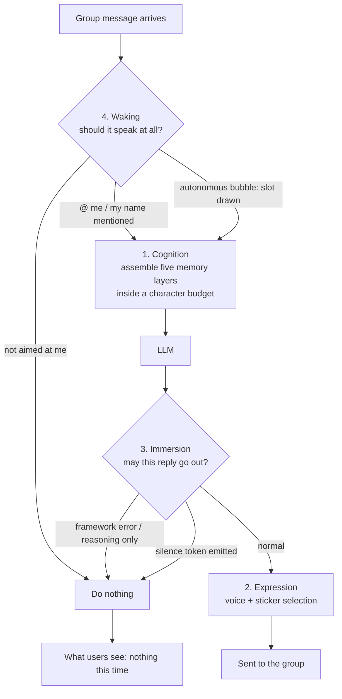

# bot-mindscape · 灵魂景观 (Mindscape)

**A universal augmentation layer that gives AI chat bots persistent cognition and seamless immersion.**

[](LICENSE)
[](https://github.com/Illusory-moon/bot-mindscape/stargazers)
[](https://github.com/Illusory-moon/bot-mindscape/releases)


> *"Tell me one thing from three days ago that left an impression on you."*
> — and it answers with **that one specific thing**, not a vague pleasantry.

**Languages:** **English** · [简体中文](README.md)

---

## ⚠️ Read this first: this is a Chinese-first project

The **framework is language-agnostic** — no language logic is hardcoded anywhere.
The **bundled personas, rules and style files are written in Chinese**, because the project
was built for Chinese QQ groups, and its author is Chinese.

If you want to use it in another language, you write your own persona / rules / style files —
exactly the same way you would define any bot's character. What you will *not* find here is
English documentation beyond this page.

**English docs, translations and adapter ports are very welcome as PRs.**

## What problem does it solve?

Every long-running bot in a group chat eventually shows the same four failures.
bot-mindscape is organised as four layers, each attacking one of them:

| Failure | Symptom | Layer |
|---|---|---|
| Goldfish memory | Forgets yesterday; re-asks what it already knows | **Cognition** |
| Robotic phrasing | Correct answers in the voice of a customer-service form letter | **Expression** |
| Breaking character | Posts `LLM response error: APITimeoutError` into the group chat | **Immersion** |
| Only speaks when poked | Replying is its only mode — it can never stay quiet | **Waking** |

## How a message flows

Every message passes four gates — **and every gate can end in doing nothing**:



Waking and Immersion are two independent **silence valves** — the part almost nobody builds,
because most bots only have one path: *message in, reply out*.

## The four layers

### 1. Cognition — long-term memory

Five sub-layers are assembled every turn inside a character budget:

```
rules   ->  this bot's own behaviour constraints (highest priority)
notes   ->  ledger, maintained by the bot itself via the save_note tool
style   ->  how this persona talks (stable layer + recent layer)
digest  ->  one line per day — the skeleton of long-term memory
diary   ->  raw events, sliding window
```

This is deliberately **not** a vector database. It is a **budgeted, layered context assembly** —
because what a roleplay bot needs is not *top-k similar chunks*, but *what happened, in order,
in its own voice*.

### 2. Expression — stickers and voice

Sticker collection (a vision model decides whether an image fits the persona, then files and tags it),
context-aware sticker selection, and following along when a group starts trading images.

### 3. Immersion — never break character

- **Guard** — swallows framework error text instead of posting it
- **Format** — flattens multi-paragraph LLM output, strips AI tics
- **Rescue** — reasoning-only responses get one second lightweight call
- **Silence** — the bot can *genuinely* say nothing: it emits a single token and the whole reply is dropped

### 4. Waking — when to speak, and when not to

`@` always answers / its name always answers / low-probability autonomous bubbles on a per-bot
timetable / **directionality judgement** (it knows whether a message was aimed at it) /
per-group allowlists.

## Install

```bash
git clone https://github.com/Illusory-moon/bot-mindscape.git
cd bot-mindscape
pip install -r requirements.txt
cp config/config.example.yaml config/config.yaml
python scripts/run_selfcheck.py    # 100 assertions, includes a privacy scan
python scripts/config_gui.py       # desktop config editor (tkinter), or:
python scripts/web_ui.py           # browser config editor at http://127.0.0.1:8777
```

Then follow [docs/deploy.md](docs/deploy.md) *(Chinese)* to wire it into your bot framework.

## Status

| | |
|---|---|
| Reference host framework | [AstrBot](https://astrbot.app) — the only adapter that is complete today |
| Other frameworks | adapters **welcome as PRs**; the core is framework-agnostic by design |
| Self-check | 100 assertions, all passing |

## More screenshots

### Waking — it speaks up on its own, and can also genuinely shut up

**Nobody called it.** The group is chatting; it picks an unnoticed moment and says one line:


The reverse also holds: it may choose to send **nothing at all** — not a "(staying quiet)"
placeholder, but literally no message for that turn.


## License

MIT
